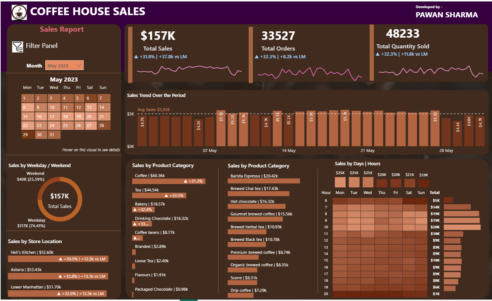

# ☕ Coffee House Sales Dashboard

## 📊 Project Overview
A comprehensive **end-to-end analytics project** for a coffee house chain.  
- The dataset was uploaded into **MySQL**.  
- Using **SQL queries**, key KPIs and insights were derived (Sales, Orders, Quantity).  
- These cleaned and aggregated results were then visualized in a **Power BI dashboard**.  

This project demonstrates the complete workflow of **data cleaning ➝ SQL analysis ➝ business insights ➝ interactive dashboarding**.

---

## 🔍 Key Features
- **Interactive calendar heatmap** showing daily sales
- **Weekday vs weekend** performance analysis
- **Top 10 products** visualization
- **Store location comparisons** with MoM metrics
- **Daily sales** with average line reference
- **SQL-powered data processing** before dashboard visualization

---

## 🛠️ Technologies Used
- **SQL (MySQL)** → Data cleaning, KPI calculations, insights  
- **Power BI** → Dashboard creation, interactivity  
- **DAX (Data Analysis Expressions)** → Advanced measures in Power BI  
- **Power Query** → Data transformation within Power BI  

---

## 📈 KPIs Tracked
1. **Total Sales Analysis**  
   - Monthly sales totals  
   - Month-on-Month (MoM) growth %  
   - MoM difference in sales  

2. **Total Orders Analysis**  
   - Monthly order count  
   - MoM growth %  
   - MoM order differences  

3. **Total Quantity Sold Analysis**  
   - Monthly quantity sold  
   - MoM growth %  
   - MoM differences  

---

## 📊 Charts Implemented
1. **Calendar Heat Map** – daily sales insights  
2. **Sales by Weekdays/Weekends** – behavioral analysis  
3. **Sales by Store Location** – regional performance with MoM change  
4. **Daily Sales with Average Line** – spotting above/below average days  
5. **Sales by Product Category** – category-level contribution  
6. **Top 10 Products** – best sellers analysis  
7. **Sales by Days/Hours Heatmap** – temporal sales behavior  

---

## 🗂️ Repository Structure
- `Sql/sql-queries.md` → All SQL queries for data cleaning and KPI calculations  
- `Dashboard/coffee-house-sales-dashboard.pbix` → Power BI dashboard file  
- `coffee-house-sales-dashboard.png` → Dashboard screenshot  

---

## 🤝 Contributing
Pull requests are welcome! For major changes, please open an issue first to discuss what you would like to change.  
